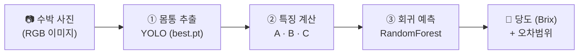

# 🍉 수박 당도 예측기 (Watermelon Sugar Predictor)

수박 **사진 한 장**을 업로드하면 겉모습(형태·줄무늬)을 분석해 **당도(Brix)** 를 예측하는 웹 앱입니다.

> **프론트엔드 작업자분께**: UI는 [Gradio](https://www.gradio.app/)로 만들어져 있습니다.
> 핵심은 **`predict()` 함수 하나**입니다 — 이미지를 넣으면 (예측 텍스트, 특징값)을 돌려줍니다.
> 디자인을 새로 짜실 때는 이 함수의 **입력/출력 형식**(아래 [예측 인터페이스](#-예측-인터페이스-프론트엔드-연동-지점) 참고)만 그대로 맞춰 주시면 됩니다.

---

## 🔄 전체 파이프라인



| 단계 | 파일 | 하는 일 |
|------|------|---------|
| ① 몸통 추출 | `body_extractor.py` | YOLO(`best.pt`)로 수박 몸통 영역만 마스크로 분리 (배경 제거). 원본 폴리곤 + 모폴로지 오프닝으로 꼭지·배경 군더더기 제거 |
| ② 특징 계산 | `feature_extractor.py` | 몸통 마스크에서 줄무늬를 추출해 수학적 특징 **A·B·C** 계산 |
| ③ 회귀 예측 | `sugar_model.pkl` | 특징 A·B·C를 입력받아 당도(Brix) 예측 (RandomForest 회귀) |

### 추출하는 특징

| 특징 | 의미 | 계산 방식 |
|------|------|-----------|
| **A (형태비율)** | 수박이 얼마나 둥근가 | 외접 사각형의 `짧은변 / 긴변` (1에 가까울수록 원형) |
| **B (선명도)** | 줄무늬 대비가 얼마나 뚜렷한가 | `바탕 밝기 − 줄무늬 밝기` |
| **C (면적 %)** | 줄무늬가 차지하는 비율 | `줄무늬 픽셀 / 몸통 픽셀 × 100` |

> 특징 D·E도 설계상 존재하지만 **예측에는 사용하지 않습니다.**

---

## 🎯 예측 인터페이스 (프론트엔드 연동 지점)

`app.py`의 `predict()` 함수가 유일한 연동 지점입니다.

```python
def predict(image_rgb):
    """
    입력:
        image_rgb : numpy.ndarray  — RGB 형식 이미지 (Gradio가 그대로 전달)

    출력: (result_text, features)
        result_text : str  — 사람이 읽는 예측 결과 (당도 + 오차범위 + 정확도)
        features    : dict — 추출된 특징값
                      {
                        "특징A (형태비율)": float,
                        "특징B (선명도)":   float,
                        "특징C (면적 %)":   float,
                      }
    """
```

**출력 `result_text` 예시**
```
🍉 예측 당도: 10.47 Brix  (± 0.73)
   예상 범위: 9.74 ~ 11.20 Brix
   ✅ 모델 정확도: 약 92.9%  (설명력 R²: 11.7%)
```

**실패 시**: `("❌ 몸통 추출 실패: ...", {})` 형태로 반환됩니다 (수박이 안 보이는 사진 등).

> UI를 새로 디자인하실 때는 `app.py` 하단의 `gr.Blocks(...)` 부분만 교체하시면 됩니다.
> `predict()` 함수 자체(AI 로직)는 건드릴 필요가 없습니다.

---

## 🚀 실행 방법

```bash
# 1. 의존성 설치
pip install -r requirements.txt

# 2. 웹 앱 실행
python app.py
# → http://127.0.0.1:7860 접속
```

**CLI로 한 장만 테스트** (UI 없이):
```bash
python predict_sugar.py test2.jpg
```

---

## 📊 모델 성능

5-Fold 교차검증 기준 (학습 샘플 121개, 당도 8.7~12.7 Brix)

| 지표 | 값 |
|------|-----|
| 평균 오차 (MAE) | **0.73 Brix** |
| RMSE | 0.99 |
| 정확도 (100% − MAPE) | **92.9%** |
| 설명력 (R²) | 0.12 |

**몸통 추출 정확도**: 정답(COCO) 마스크 대비 평균 IoU **0.98** (검출 실패 0건).

---

## 📁 파일 구조

```
├── app.py                  # 🟢 Gradio 웹 앱 (프론트엔드 진입점)
├── predict_sugar.py        # 🟢 CLI 예측 (단일 이미지)
├── body_extractor.py       #    ① 몸통 추출 로직
├── feature_extractor.py    #    ② 특징 계산 로직
├── best.pt                 #    YOLO 몸통추출 모델 (23MB)
├── sugar_model.pkl         #    당도 회귀 모델 (RandomForest)
├── requirements.txt        #    의존성
├── test1~4.jpg             #    예시 이미지
│
├── retrain_sugar_model.py  #    [학습] 회귀모델 재학습 (데이터셋 필요)
├── visualize_body_check.py #    [검증] 몸통 추출 결과 시각화
├── compare_yolo_iou.py     #    [검증] 추출 정확도(IoU) 측정
├── validate_body_extraction.py
├── coco_body_extractor.py
├── hsv_tuner.py            #    [도구] 줄무늬 HSV 임계값 튜닝
├── watermelon_body_train.ipynb  # YOLO(best.pt) 학습 노트북
└── 최종_수박_학습데이터_원본120.csv  # 학습용 라벨 데이터
```

> ⚠️ **학습 데이터셋(`Watermelon.coco/`, 679MB)은 저장소에 포함되지 않습니다.**
> 앱 실행과 UI 작업에는 필요 없으며, 회귀모델 재학습(`retrain_sugar_model.py`) 시에만 필요합니다.

---

## 🛠️ 기술 스택

- **AI 비전**: Ultralytics YOLOv8 (몸통 세그멘테이션)
- **영상 처리**: OpenCV (CLAHE, HSV 줄무늬 추출, 모폴로지)
- **머신러닝**: scikit-learn (RandomForest 회귀)
- **웹 UI**: Gradio
